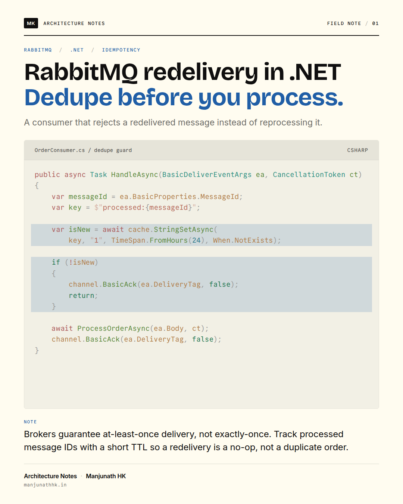
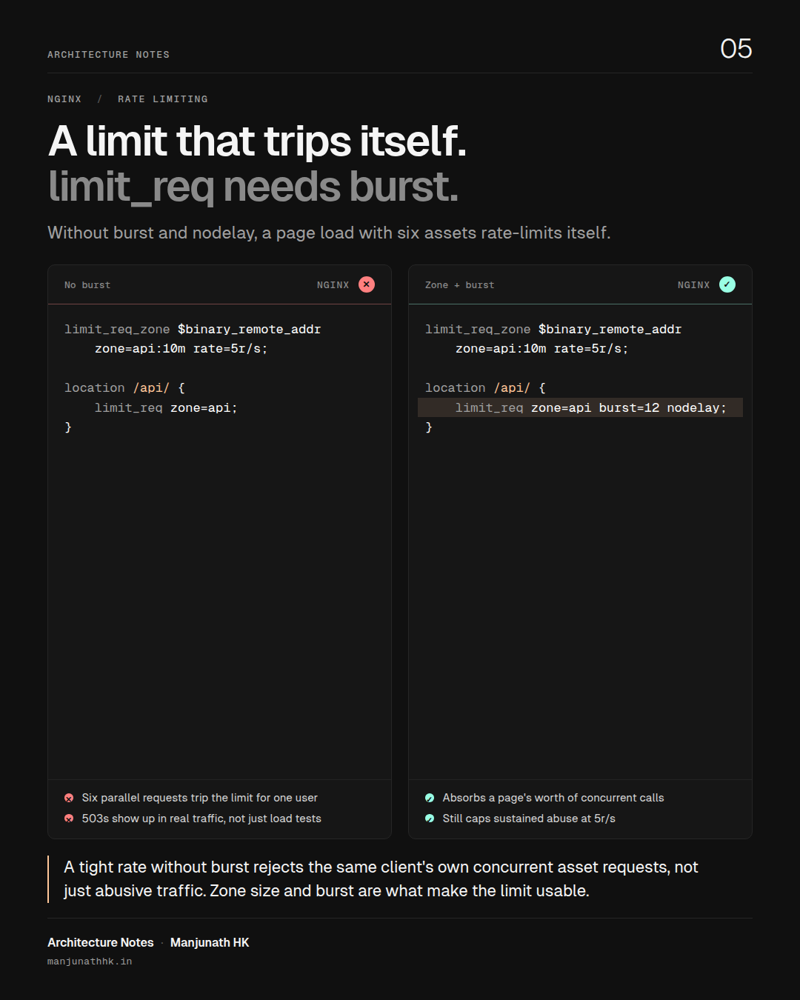
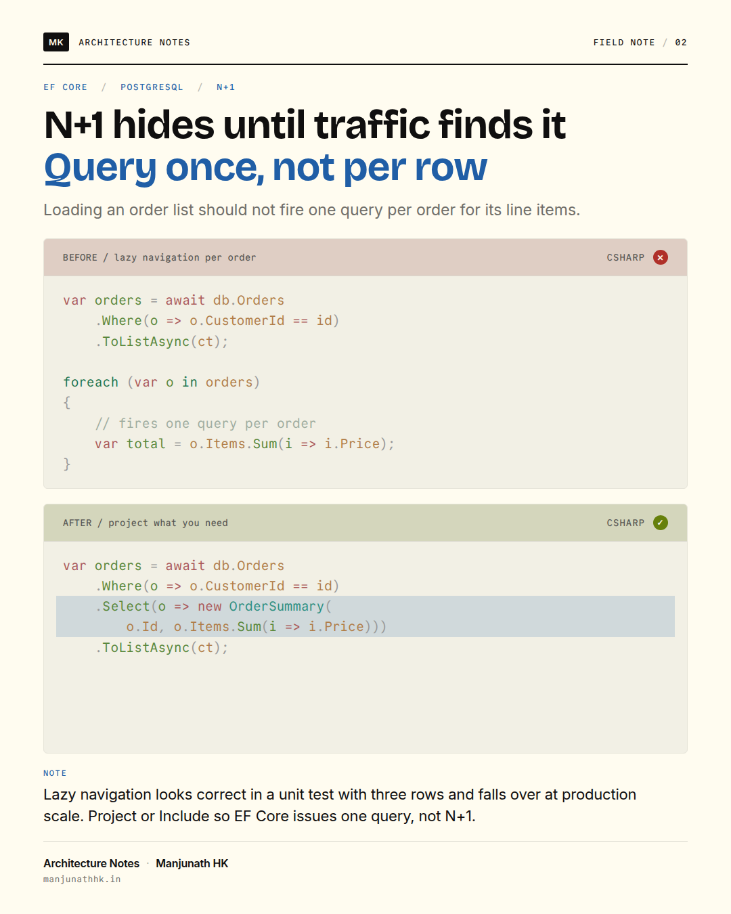
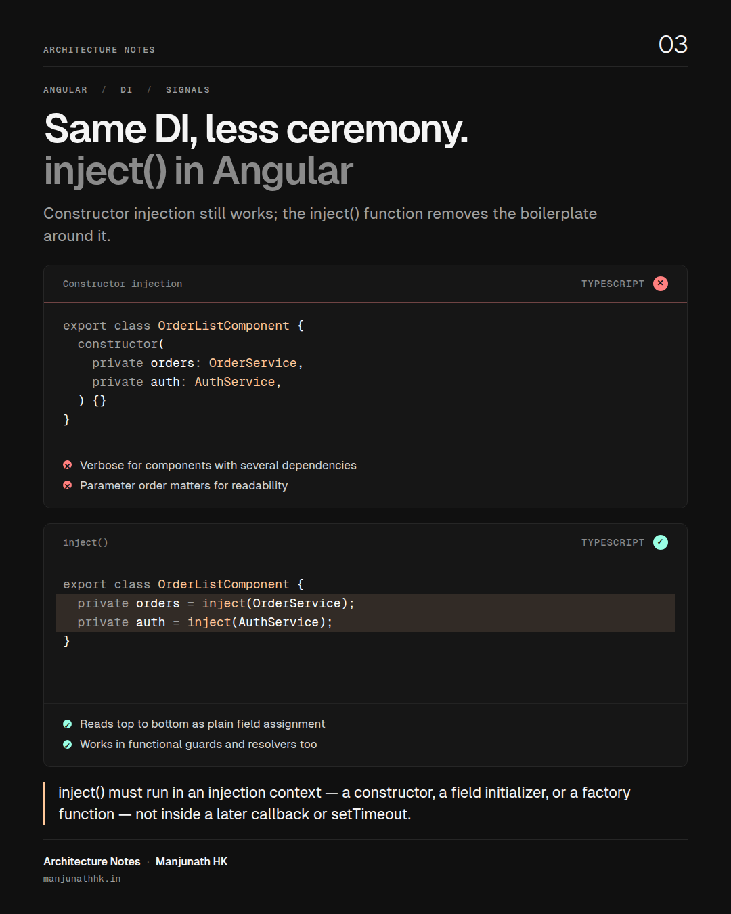
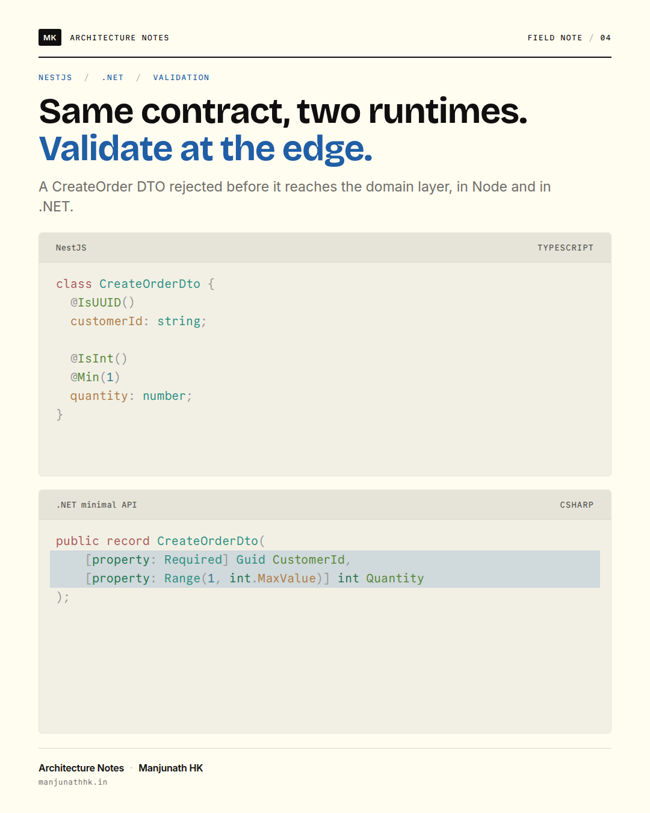
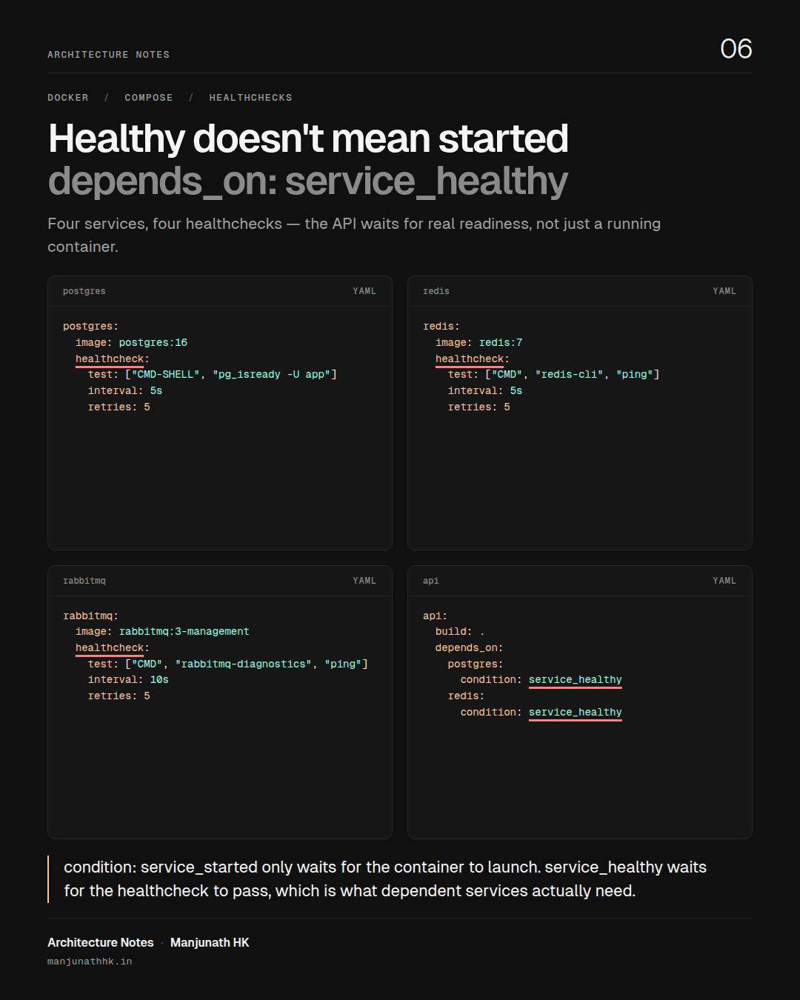

# Social Card Generator

[](https://github.com/manjunathhk/social-card-generator/actions/workflows/ci.yml)
[](LICENSE)
[](.nvmrc)

Turn a Markdown file into a polished 1080 × 1350 technical social card, or a whole folder of them into a LinkedIn carousel PDF. Syntax highlighting comes from [Shiki](https://shiki.style) (the same grammars VS Code uses); layout and capture come from headless Chromium via [Playwright](https://playwright.dev). Nothing touches the network at render time, and a card that would overflow fails loudly instead of clipping.

<p align="center">
  
  
</p>

## Why

Posting code on LinkedIn or X means screenshots, and screenshots from an editor are inconsistent, unbranded, and hard to reproduce. This tool treats a card as source: a small Markdown or JSON file you can diff, review, and regenerate whenever the brand or theme changes.

## Features

- **Three layouts.** `stack` (one or two panels), `columns` (side-by-side comparison), `grid` (up to four panels).
- **Two themes.** `print`, a paper-and-ink journal page with light code panels, and `vesper`, near-black minimalism with one peach accent. Each theme owns its palette, typefaces and shape through a documented token contract.
- **Panel decorations.** Line highlights, token underlines, ✓ / ✕ verdict badges, and short bullet notes per panel.
- **Carousel PDF.** Several cards in one command become a multi-page PDF, the format LinkedIn uses for swipeable posts.
- **Fit or fail.** Code shrinks within a per-layout range until it fits; if it still cannot fit, the run fails with the panel name and the reason.
- **Deterministic and offline.** Fonts are embedded, external requests are blocked, and the same source always yields the same pixels.
- **Brandable.** Author, series, monogram and website come from a `.env` file, never from code.

## Gallery

| `stack` · print                                                          | `stack` · print, verdicts                                              | `stack` · vesper, notes                                                    |
| ------------------------------------------------------------------------ | ---------------------------------------------------------------------- | -------------------------------------------------------------------------- |
| [](examples/rabbitmq-idempotency.md) | [](examples/ef-core-n-plus-one.json) | [](examples/angular-inject.md)               |
| `stack` · two languages                                                  | `columns` · vesper, notes + verdicts                                   | `grid` · vesper, underlines                                                |
| [](examples/dto-validation.md)             | [](examples/nginx-rate-limit.md)       | [](examples/compose-healthchecks.json) |

All six, in order, as one carousel: [sample/carousel.pdf](sample/carousel.pdf). Regenerate everything with `npm run samples`.

## Quick start

Requires Node.js 24 or newer.

```sh
git clone https://github.com/manjunathhk/social-card-generator.git
cd social-card-generator
npm ci
npm run browser:install          # downloads Chromium for Playwright (once)
npm run card -- examples/nginx-rate-limit.md
```

The card is written to `out/nginx-rate-limit.png`. On Linux, add system libraries with `npx playwright install --with-deps chromium` if the launch complains. To use a Chromium you already have, set `CARD_BROWSER_PATH=/path/to/chromium` instead of downloading one.

Once published to npm the same tool runs without cloning:

```sh
npx @manjunathhk/social-card-generator my-card.md
```

## Writing a card

A card is YAML front matter followed by one fenced code block per panel. Headings label panels, a ✅ or ❌ prefix sets the verdict, `{5}` after the language highlights lines, and bullets after a fence become notes. This is [examples/nginx-rate-limit.md](examples/nginx-rate-limit.md), one of the samples in the gallery above:

````markdown
---
title: A limit that trips itself.
highlight: limit_req needs burst.
subtitle: Without burst and nodelay, a page load with six assets rate-limits itself.
tags: [NGINX, Rate limiting]
issue: '05'
layout: columns
theme: vesper
insight: A tight rate without burst rejects the same client's own concurrent
  asset requests, not just abusive traffic. Zone size and burst are what
  make the limit usable.
---

## ❌ No burst

```nginx
limit_req_zone $binary_remote_addr
    zone=api:10m rate=5r/s;

location /api/ {
    limit_req zone=api;
}
```

- Six parallel requests trip the limit for one user
- 503s show up in real traffic, not just load tests

## ✅ Zone + burst

```nginx {5}
limit_req_zone $binary_remote_addr
    zone=api:10m rate=5r/s;

location /api/ {
    limit_req zone=api burst=12 nodelay;
}
```

- Absorbs a page's worth of concurrent calls
- Still caps sustained abuse at 5r/s
````

The same fields are available as JSON, which exposes everything explicitly — including `underline`, which Markdown has no syntax for. This is [examples/compose-healthchecks.json](examples/compose-healthchecks.json):

```json
{
  "title": "Healthy doesn't mean started",
  "highlight": "depends_on: service_healthy",
  "subtitle": "Four services, four healthchecks — the API waits for real readiness, not just a running container.",
  "tags": ["Docker", "Compose", "Healthchecks"],
  "issue": "06",
  "layout": "grid",
  "theme": "vesper",
  "insight": "condition: service_started only waits for the container to launch. service_healthy waits for the healthcheck to pass, which is what dependent services actually need.",
  "panels": [
    {
      "label": "postgres",
      "language": "yaml",
      "underline": ["healthcheck"],
      "code": "postgres:\n  image: postgres:16\n  healthcheck:\n    test: [\"CMD-SHELL\", \"pg_isready -U app\"]\n    interval: 5s\n    retries: 5"
    },
    {
      "label": "redis",
      "language": "yaml",
      "underline": ["healthcheck"],
      "code": "redis:\n  image: redis:7\n  healthcheck:\n    test: [\"CMD\", \"redis-cli\", \"ping\"]\n    interval: 5s\n    retries: 5"
    },
    {
      "label": "rabbitmq",
      "language": "yaml",
      "underline": ["healthcheck"],
      "code": "rabbitmq:\n  image: rabbitmq:3-management\n  healthcheck:\n    test: [\"CMD\", \"rabbitmq-diagnostics\", \"ping\"]\n    interval: 10s\n    retries: 5"
    },
    {
      "label": "api",
      "language": "yaml",
      "underline": ["service_healthy"],
      "code": "api:\n  build: .\n  depends_on:\n    postgres:\n      condition: service_healthy\n    redis:\n      condition: service_healthy"
    }
  ]
}
```

### Card fields

| Field       | Required | Default | Limit                                                 |
| ----------- | -------- | ------- | ----------------------------------------------------- |
| `title`     | yes      |         | 70 characters                                         |
| `subtitle`  | yes      |         | 150 characters                                        |
| `highlight` | no       | empty   | 70 characters; second title line in the accent colour |
| `tags`      | no       | `[]`    | up to 3, 22 characters each                           |
| `insight`   | no       | empty   | 220 characters; the "design note" under the panels    |
| `issue`     | no       | `01`    | 12 characters                                         |
| `layout`    | no       | `stack` | `stack`, `columns`, `grid`                            |
| `theme`     | no       | `print` | `print`, `vesper`                                     |
| `panels`    | yes      |         | count depends on the layout                           |

### Panel fields

| Field            | Required | Notes                                                                      |
| ---------------- | -------- | -------------------------------------------------------------------------- |
| `language`       | yes      | Any Shiki language id or alias (`csharp`, `cs`, `ts`, `yaml`, `sql`)       |
| `code`           | yes      | Up to 4000 characters; line limit depends on the layout                    |
| `label`          | no       | Header text; defaults to the language name                                 |
| `highlightLines` | no       | One-based line numbers; Markdown uses `{1,3-5}` on the fence               |
| `underline`      | no       | Exact substrings to underline; up to 6; JSON only                          |
| `verdict`        | no       | `good` or `bad`; Markdown uses a ✅ / ❌ heading prefix                    |
| `notes`          | no       | Up to 3 bullets of 70 characters; Markdown uses `- ` lines after the fence |

### Themes

| Theme    | Ground and ink                     | Code panels                             | Type                                    |
| -------- | ---------------------------------- | --------------------------------------- | --------------------------------------- |
| `print`  | Flexoki paper and ink, blue accent | Light, `vitesse-light`, hairline border | Bricolage Grotesque, Inter, Commit Mono |
| `vesper` | Near-black, one peach accent       | `#161616`, `vesper`, no chrome          | Geist Sans, Geist Mono                  |

A theme sets colours, typefaces and panel shape through custom properties; layouts set sizes and spacing through their own tokens. The two never overlap, so any theme works with any layout. Only the fonts of the themes a document uses are embedded.

### Layouts

| Layout    | Panels | Max lines per panel | Code font range | Best for                              |
| --------- | ------ | ------------------- | --------------- | ------------------------------------- |
| `stack`   | 1–2    | 22 (one) / 14 (two) | 20 → 16 px      | A single snippet, or before / after   |
| `columns` | 2      | 18                  | 18 → 13 px      | Side-by-side comparison with verdicts |
| `grid`    | 3–4    | 12                  | 16 → 12 px      | Four short variants of the same idea  |

Character limits are ceilings, not guarantees. The renderer measures the real layout and refuses to emit a card whose code or footer would be clipped; the error names the panel and what to shorten.

## Command line

```
social-card <input.md|input.json|directory>... [options]

  --out-dir <dir>   Directory for PNG output (default: out)
  --out <file.png>  Explicit PNG path; allowed with exactly one input
  --pdf <file.pdf>  Also write every card, in order, as one multi-page PDF
  --pdf-only        Write the PDF but skip the PNGs
  --scale <1|2|3>   Device scale factor for PNGs (2 gives crisper text after platform compression)
  --html            Also write the rendered HTML next to each PNG for debugging
  --env <file>      Branding env file (default: .env in the current directory)
  --help            Show usage and exit
  --version         Print the installed version and exit
```

During development run it as `npm run card -- <args>`. A directory input renders every `.md` and `.json` inside it in name order, which is how a carousel is assembled:

```sh
npm run card -- posts/2026-09-caching --pdf out/caching-carousel.pdf --scale 2
```

## Branding

Copy `.env.sample` to `.env` and fill in your details. Every field is optional: leave a variable blank or unset and the card simply omits it, instead of falling back to placeholder text like `example.com`.

| Variable            | Default                                | Purpose                                          |
| ------------------- | -------------------------------------- | ------------------------------------------------ |
| `CARD_AUTHOR`       | blank                                  | Footer author                                    |
| `CARD_WEBSITE`      | blank                                  | Footer website                                   |
| `CARD_SERIES`       | blank                                  | Masthead series name and footer prefix           |
| `CARD_MONOGRAM`     | author's initials (blank if no author) | Small boxed mark in the masthead                 |
| `CARD_FOOTER_MARK`  | blank                                  | Optional large mark bottom-right; blank hides it |
| `CARD_ISSUE_LABEL`  | blank                                  | Prefix before the issue number                   |
| `CARD_LINKEDIN`     | blank                                  | LinkedIn link/handle, added to the footer        |
| `CARD_TWITTER`      | blank                                  | Twitter/X link/handle, added to the footer       |
| `CARD_BROWSER_PATH` | Playwright's build                     | Use an existing Chromium binary                  |

`CARD_WEBSITE`, `CARD_LINKEDIN` and `CARD_TWITTER` are rendered as one contact line in the footer, separated by `·`, in that order — each appears only when set.

Shell variables override the file. The committed samples use `examples/branding.env`. When [running as a server](#running-it-as-a-server-docker), these same variables set on the container become the sandbox's default branding fields for every visitor — but that default is read-only from the browser. Editing the Branding fields in the sandbox UI only saves to that browser's own storage; it's a personal override, not a way to change what other visitors see or to update the container's environment. To change the shared default, recreate the container with new `CARD_*` values. See [docs/TECHNIQUES.md](docs/TECHNIQUES.md#branding-one-server-default-read-only-from-the-ui) for why a UI-editable shared default isn't implemented.

## Browser sandbox

The same core runs in a browser for quick experiments: a Markdown or JSON editor with live preview, layout and theme pickers, a custom palette editor that can be copied out as a theme file, and PNG export.

```sh
npm run sandbox        # writes out/sandbox.html
```

Open `out/sandbox.html` directly in a browser. It has no server, no build watcher and no network dependency beyond the UI font. The PNGs it exports are rasterised by the browser and are close to the CLI's output but not byte-identical; PDF carousels and the full Shiki language list remain CLI features. The sandbox is a development aid and a prototype for a future hosted editor; see the section on running the core in the browser in [docs/TECHNIQUES.md](docs/TECHNIQUES.md).

It also has a **New** button to start a blank card, and a **History** panel: every PNG you export is kept — source, layout, theme and branding included — so you can reopen it later and pick up editing where you left off. History is append-only: reopening and exporting again adds a new entry rather than overwriting the old one. History always lives in that browser's own storage (IndexedDB), whether the page is opened as a plain file or served — see the next section for why.

## Running it as a server (Docker)

`npm run sandbox` on its own produces a single file with no server behind it. Serving the same bundle from a small server buys you one thing: a stable URL you (and anyone else you share it with) can open from any device, plus server-side branding defaults and metrics. It does **not** buy shared history — every visitor's exported cards stay in that visitor's own browser, never on the server, and never visible to anyone else who opens the same URL. That's deliberate: this server has no login, so "shared" storage would mean everyone who can reach the URL can see everyone else's cards.

```sh
docker compose up --build
# → http://localhost:8787
```

Or without Compose:

```sh
docker build -t social-card-sandbox .
docker run -p 8787:8787 social-card-sandbox
```

Pass the [branding variables](#branding) as environment variables when creating the container, and they become the sandbox's default branding fields for every visitor (still editable per-browser, and still all optional):

```sh
docker run -p 8787:8787 \
  -e CARD_AUTHOR="Your Name" -e CARD_WEBSITE="example.com" -e CARD_SERIES="Field Notes" \
  social-card-sandbox
```

The page is served at `/`, never at a `.html` path. The container needs no Chromium and no volume: rendering happens in the visitor's browser, and the server itself stores nothing — it has no database and no `/data` directory, so there is nothing on it for one visitor to read that another created. There is still **no authentication**: anyone who can reach the URL can use the tool and sees the same server-wide branding defaults, but never another visitor's cards. That's the right tradeoff for a personal, self-hosted instance on a private network; put an auth layer in front (a reverse proxy with basic auth, an SSO gateway, etc.) if you also want to restrict who can _use_ it at all.

Browser storage is scoped to the browser, not to a person: the same visitor opening this URL from a second browser, a different device, or a private/incognito window starts with empty history there too, and clearing that browser's site data clears it for good. There's no way to see the same history from two places without adding real accounts — this trades that off deliberately for "no login required."

| Command                     | What it does                                               |
| --------------------------- | ---------------------------------------------------------- |
| `npm run serve`             | Runs the server from source (`tsx`), for local development |
| `npm run build:server`      | Compiles the server to `dist-server/`                      |
| `npm run test:server`       | Runs the server's HTTP route tests; no browser needed      |
| `docker compose up --build` | Builds the image and runs it                               |

### Deploying a prebuilt image (VPS)

CI publishes the image built from `main` to Docker Hub (`linux/amd64` and `linux/arm64`), so a VPS can pull it directly instead of building from source:

```sh
docker run -d --name social-card-sandbox -p 127.0.0.1:8787:8787 \
  --restart unless-stopped manjunathhk/social-card-generator:latest
```

Bind the published port to `127.0.0.1` (not `0.0.0.0`/bare `8787:8787`) once a reverse proxy is in front of it — the app has no auth by design (see above), so the loopback bind is what actually keeps port 8787 from being reachable from the public internet directly, bypassing the proxy and whatever TLS/access rules live there. Every push publishes `:latest` and the exact commit `:<git-sha>`; a push whose commits warrant a release (see below) also gets `:<version>` (the bumped `version` field in `package.json`, e.g. `:2.3.0`). Pin to `:<version>` or `:<git-sha>` instead of `:latest` if you want deploys to be explicit.

#### Reverse-proxying with nginx

A subdomain is the simplest setup — one `server` block, no path-rewriting to get wrong. This project's own instance runs at `social-card.manjunathhk.in`:

```nginx
server {
  listen 443 ssl http2;
  server_name social-card.manjunathhk.in;

  ssl_certificate     /etc/letsencrypt/live/social-card.manjunathhk.in/fullchain.pem;
  ssl_certificate_key /etc/letsencrypt/live/social-card.manjunathhk.in/privkey.pem;

  location / {
    proxy_pass http://127.0.0.1:8787/;
    proxy_set_header Host $host;
    proxy_set_header X-Real-IP $remote_addr;
    proxy_set_header X-Forwarded-For $proxy_add_x_forwarded_for;
    proxy_set_header X-Forwarded-Proto $scheme;
  }
}
server { listen 80; server_name social-card.manjunathhk.in; return 301 https://$host$request_uri; }
```

(`certbot --nginx -d social-card.manjunathhk.in` provisions and renews the certificate.)

Every API call the sandbox makes (`api/health`, `api/branding`, `api/cards`, …) uses a path relative to the page's own URL rather than a domain-root-absolute one, so this also works reverse-proxied under a path instead of a subdomain (`example.com/social-card/`) if you're already committed to one:

```nginx
location /social-card/ {
  # trailing slash on proxy_pass strips the /social-card/ prefix before
  # forwarding, so the container still sees plain / and /api/... requests
  proxy_pass http://127.0.0.1:8787/;
  proxy_set_header Host $host;
}
# nginx won't match /social-card (no trailing slash) against the block above
location = /social-card { return 301 /social-card/; }
```

#### Metrics (Prometheus / Grafana)

`GET /api/metrics` exposes request counts and request-duration histograms in Prometheus text format (`text/plain; version=0.0.4`) — no dependency on `prom-client`, keeping the runtime image's zero-`node_modules` design (see the Dockerfile) intact. Route labels are a fixed, low-cardinality set assigned by the server, never a literal path with user input in it, so scraping never grows unbounded label cardinality.

If Prometheus runs on the same host (typical for a single VPS), scrape the container directly over loopback — it's already bound to `127.0.0.1:8787` per above, so this never touches nginx or the public vhost at all:

```yaml
scrape_configs:
  - job_name: social-card-sandbox
    static_configs:
      - targets: ['127.0.0.1:8787']
    metrics_path: /api/metrics
```

If Prometheus runs elsewhere (a different host, or a container on its own Docker network), either put this container on that network and target it by container name, or add a `location /api/metrics` block scoped to Prometheus's IP — never leave it open on the public vhost next to the app it's monitoring.

Then build Grafana panels from, e.g.:

- `sum(rate(http_requests_total[5m])) by (route, status)` — traffic and error rate by endpoint
- `histogram_quantile(0.95, sum(rate(http_request_duration_seconds_bucket[5m])) by (le, route))` — p95 latency by route
- `nodejs_heap_used_bytes` and `process_uptime_seconds` — basic process health

A dashboard nobody's watching isn't monitoring — add alert rules alongside the scrape job so Prometheus pages you instead:

```yaml
groups:
  - name: social-card-sandbox
    rules:
      - alert: SocialCardDown
        expr: up{job="social-card-sandbox"} == 0
        for: 2m
        labels: { severity: critical }
        annotations: { summary: 'Social Card Sandbox is unreachable.' }

      - alert: SocialCardHighErrorRate
        expr: |
          sum(rate(http_requests_total{job="social-card-sandbox",status=~"5.."}[5m]))
          / sum(rate(http_requests_total{job="social-card-sandbox"}[5m])) > 0.05
        for: 5m
        labels: { severity: warning }
        annotations: { summary: 'Over 5% of requests are failing (5xx).' }

      - alert: SocialCardHighLatency
        expr: |
          histogram_quantile(0.95, sum(rate(http_request_duration_seconds_bucket{job="social-card-sandbox"}[5m])) by (le)) > 1
        for: 10m
        labels: { severity: warning }
        annotations: { summary: 'p95 request latency is over 1s.' }
```

Route these through whatever Alertmanager you already have handling your other domains — nothing here is specific to this app beyond the `job` label matching the scrape config above.

`version` in `package.json` and `CHANGELOG.md` are hand-edited, not cut by CI. See [CONTRIBUTING.md](CONTRIBUTING.md) ("Releasing") for the manual bump process — the `publish` job below just reads whatever version `package.json` currently holds and tags the image with it.

#### Publishing to Docker Hub

The `publish` job in [`.github/workflows/ci.yml`](.github/workflows/ci.yml) builds and pushes the image after `verify` and `docker` pass on `main`, or on a manual `workflow_dispatch` run. It needs two repo secrets, and silently skips publishing without them (CI still stays green):

| Setting (Settings → Secrets and variables → Actions) | Value                                                                                                 |
| ---------------------------------------------------- | ----------------------------------------------------------------------------------------------------- |
| Secret `DOCKERHUB_USERNAME`                          | Your Docker Hub username                                                                              |
| Secret `DOCKERHUB_TOKEN`                             | A Docker Hub [access token](https://hub.docker.com/settings/security) (not your password)             |
| Variable `DOCKERHUB_IMAGE` (optional)                | Target image, e.g. `yourname/social-card-generator` — defaults to `manjunathhk/social-card-generator` |

## How it works

Source → parse and validate → Shiki highlights each panel → an HTML document with embedded fonts and the theme's CSS → Chromium lays it out → an in-page script shrinks code to fit or reports overflow → screenshot (PNG) or print (PDF).

The techniques behind each stage, including the fit loop, the theme contract, Shiki decorations, the PDF pagination trick, and how to add a layout or theme, are written up in [docs/TECHNIQUES.md](docs/TECHNIQUES.md).

## Development

| Command               | What it does                                                 |
| --------------------- | ------------------------------------------------------------ |
| `npm run check`       | Type-check with `tsc`                                        |
| `npm test`            | Unit tests (parser, validation, template); no browser needed |
| `npm run test:render` | Browser tests: PNG size, fit loop, PDF page count            |
| `npm run lint`        | Prettier check                                               |
| `npm run format`      | Prettier write                                               |
| `npm run build`       | Compile to `dist/` (what the `social-card` binary runs)      |
| `npm run samples`     | Regenerate `sample/` from `examples/`                        |

CI runs all of the above on every push and uploads the rendered gallery as an artifact. See [CONTRIBUTING.md](CONTRIBUTING.md) for the conventions.

## Roadmap

- Size presets: 1080 × 1080 square and 1200 × 630 Open Graph.
- A `terminal` panel style for showing program output under code.
- A text-only `list` layout for numbered rules and checklists.
- Publish to npm.

## Prior art

Other tools turn code into a shareable image. None combine a diffable source file, a deterministic offline render, and a carousel export the way this one does:

| Tool                                                      | Form                          | Self-hostable                            | Carousel / multi-panel              | Source-controlled                                   |
| --------------------------------------------------------- | ----------------------------- | ---------------------------------------- | ----------------------------------- | --------------------------------------------------- |
| [Carbon](https://carbon.now.sh)                           | Web only                      | No                                       | No                                  | No — paste and screenshot                           |
| [Ray.so](https://ray.so)                                  | Web only (Raycast)            | No                                       | No                                  | No                                                  |
| [Snappify](https://snappify.com)                          | Paid SaaS + API               | No                                       | Yes (slides) — closest on this axis | No                                                  |
| [Chalk.ist](https://chalk.ist)                            | Web, has an API               | No                                       | No                                  | No                                                  |
| [CodeImage](https://codeimage.dev)                        | Web, open source              | Yes                                      | No                                  | No                                                  |
| [Silicon](https://github.com/Aloxaf/silicon)              | CLI (Rust)                    | N/A — local binary                       | No                                  | Yes, but no card/branding concept                   |
| [freeze](https://github.com/charmbracelet/freeze)         | CLI (Go)                      | N/A — local binary                       | No                                  | Yes (a config file)                                 |
| [carbon-now-cli](https://github.com/mixn/carbon-now-cli)  | CLI wrapper around Carbon     | No — drives the live site via Playwright | No                                  | Partial                                             |
| [Satori](https://github.com/vercel/satori) / `@vercel/og` | Programmatic OG-image library | Yes — you own the runtime                | No                                  | Yes, but each image is React/JSX, not a card format |

Snappify is the nearest match on carousels, but it's closed SaaS with no self-host option. Silicon and freeze are the nearest on "local, scriptable, CLI-first," but neither has the layout/theme/branding contract a repeatable social card needs. This project sits at the intersection: a Markdown or JSON file you can diff and review, rendered the same way every time, self-hosted as a Docker image when you want a stable URL to reach it from.

## License

MIT. See [LICENSE](LICENSE). Embedded typefaces (Inter, Bricolage Grotesque, Commit Mono, Geist Sans, Geist Mono) are under the SIL Open Font License; see [THIRD_PARTY_NOTICES.md](THIRD_PARTY_NOTICES.md).
