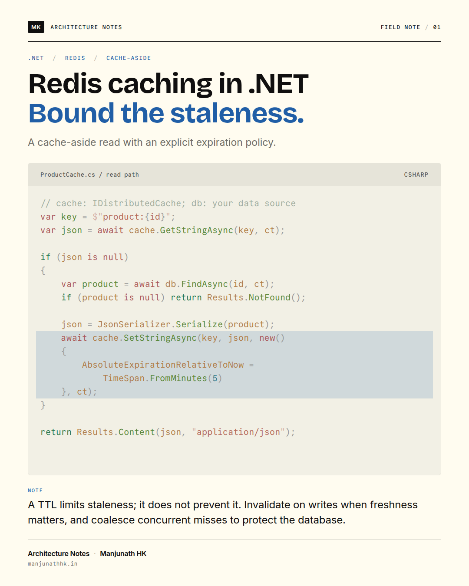
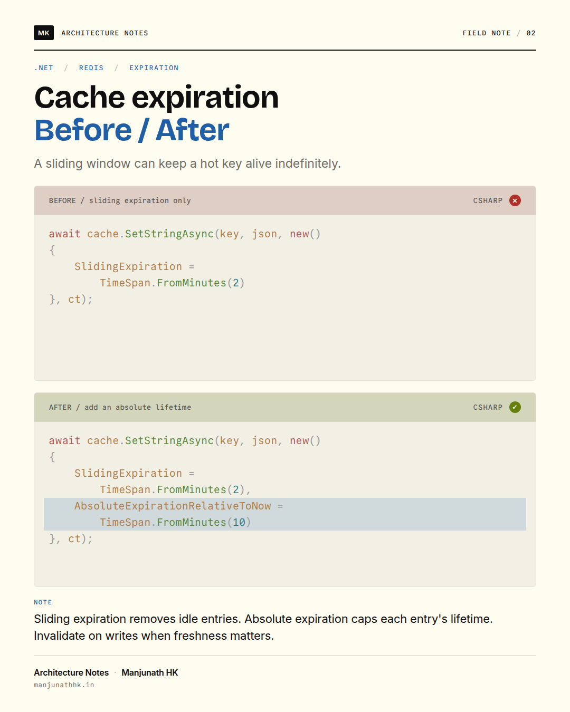
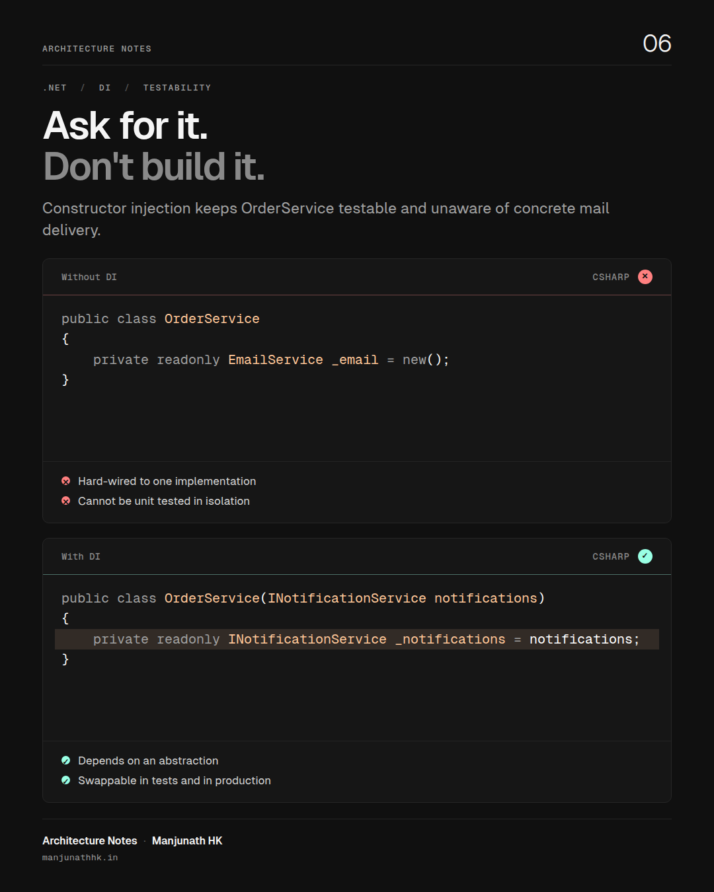
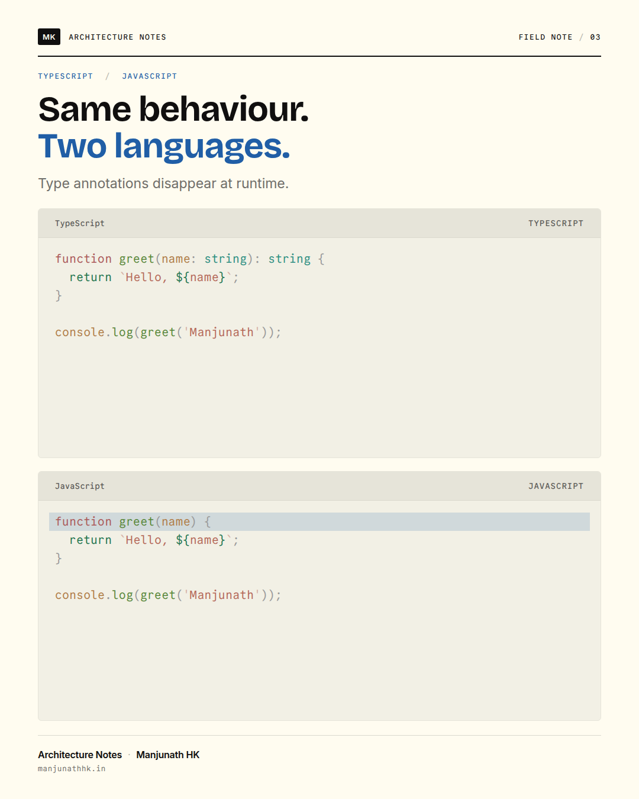
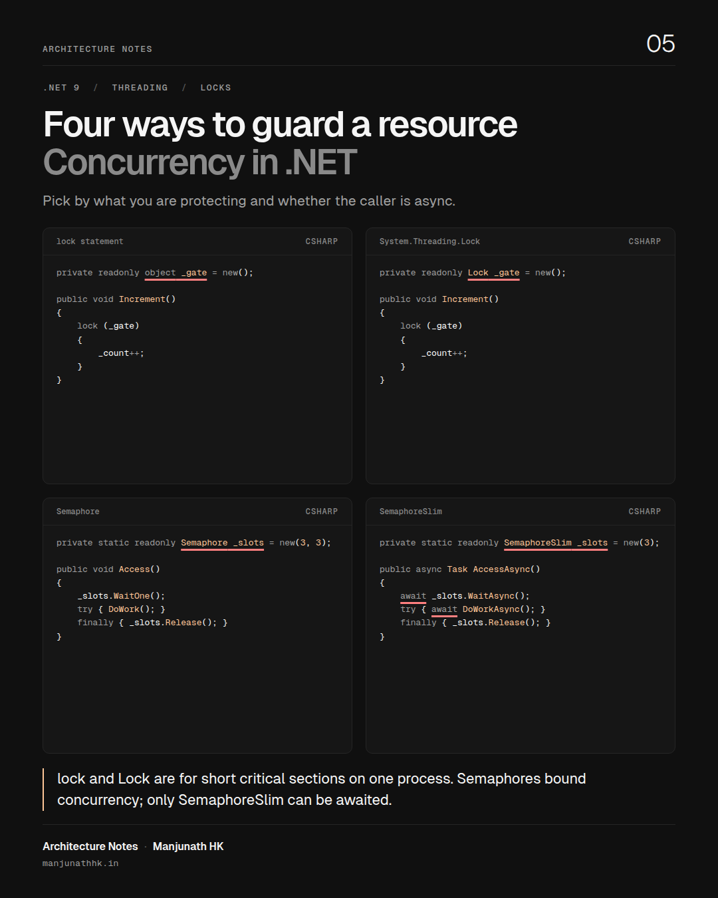

# Social Card Generator

[](https://github.com/manjunathhk/social-card-generator/actions/workflows/ci.yml)
[](LICENSE)
[](.nvmrc)

Turn a Markdown file into a polished 1080 × 1350 technical social card, or a whole folder of them into a LinkedIn carousel PDF. Syntax highlighting comes from [Shiki](https://shiki.style) (the same grammars VS Code uses); layout and capture come from headless Chromium via [Playwright](https://playwright.dev). Nothing touches the network at render time, and a card that would overflow fails loudly instead of clipping.

<p align="center">
  
  
</p>

## Why

Posting code on LinkedIn or X means screenshots, and screenshots from an editor are inconsistent, unbranded, and hard to reproduce. This tool treats a card as source: a small Markdown or JSON file you can diff, review, and regenerate whenever the brand or theme changes.

## Features

- **Three layouts.** `stack` (one or two panels), `columns` (side-by-side comparison), `grid` (up to four panels).
- **Two themes.** `print`, a paper-and-ink journal page with light code panels, and `vesper`, near-black minimalism with one peach accent. Each theme owns its palette, typefaces and shape through a documented token contract.
- **Panel decorations.** Line highlights, token underlines, ✓ / ✕ verdict badges, and short bullet notes per panel.
- **Carousel PDF.** Several cards in one command become a multi-page PDF, the format LinkedIn uses for swipeable posts.
- **Fit or fail.** Code shrinks within a per-layout range until it fits; if it still cannot fit, the run fails with the panel name and the reason.
- **Deterministic and offline.** Fonts are embedded, external requests are blocked, and the same source always yields the same pixels.
- **Brandable.** Author, series, monogram and website come from a `.env` file, never from code.

## Gallery

| `stack` · print                                                            | `stack` · print, verdicts                                  | `stack` · vesper, notes                                                  |
| -------------------------------------------------------------------------- | ---------------------------------------------------------- | ------------------------------------------------------------------------ |
| [](examples/redis-caching.md)                 | [](examples/before-after.json) | [](examples/dependency-injection.md) |
| `stack` · two languages                                                    | `columns` · vesper, notes + verdicts                       | `grid` · vesper, underlines                                              |
| [](examples/typescript-javascript.md) | [](examples/span-columns.md)   | [](examples/concurrency-grid.json)       |

All six, in order, as one carousel: [sample/carousel.pdf](sample/carousel.pdf). Regenerate everything with `npm run samples`.

## Quick start

Requires Node.js 22 or newer.

```sh
git clone https://github.com/manjunathhk/social-card-generator.git
cd social-card-generator
npm ci
npm run browser:install          # downloads Chromium for Playwright (once)
npm run card -- examples/span-columns.md
```

The card is written to `out/span-columns.png`. On Linux, add system libraries with `npx playwright install --with-deps chromium` if the launch complains. To use a Chromium you already have, set `CARD_BROWSER_PATH=/path/to/chromium` instead of downloading one.

Once published to npm the same tool runs without cloning:

```sh
npx @manjunathhk/social-card-generator my-card.md
```

## Writing a card

A card is YAML front matter followed by one fenced code block per panel. Headings label panels, a ✅ or ❌ prefix sets the verdict, `{2,4-6}` after the language highlights lines, and bullets after a fence become notes.

````markdown
---
title: Slice, don't copy.
highlight: Span<T> in hot paths
subtitle: The same parsing logic, with and without a new string per call.
tags: [.NET, Performance, Span]
issue: '04'
layout: columns
theme: vesper
insight: Substring allocates a new string every call. Slicing reuses memory the caller owns.
---

## ❌ Substring

```csharp
var id = line.Substring(4, 6);
```

- Allocates a new string per call

## ✅ Span

```csharp {1}
var id = line.Slice(4, 6);
```

- Works over the caller's memory
````

The same card as JSON gives you every option explicitly, including `underline`:

```json
{
  "title": "Slice, don't copy.",
  "subtitle": "The same parsing logic, with and without a new string per call.",
  "layout": "columns",
  "theme": "vesper",
  "panels": [
    { "label": "Substring", "language": "csharp", "verdict": "bad", "code": "var id = line.Substring(4, 6);" },
    {
      "label": "Span",
      "language": "csharp",
      "verdict": "good",
      "highlightLines": [1],
      "underline": ["Slice"],
      "code": "var id = line.Slice(4, 6);"
    }
  ]
}
```

### Card fields

| Field       | Required | Default     | Limit                                                 |
| ----------- | -------- | ----------- | ----------------------------------------------------- |
| `title`     | yes      |             | 70 characters                                         |
| `subtitle`  | yes      |             | 150 characters                                        |
| `highlight` | no       | empty       | 70 characters; second title line in the accent colour |
| `tags`      | no       | `[]`        | up to 3, 22 characters each                           |
| `insight`   | no       | empty       | 220 characters; the "design note" under the panels    |
| `issue`     | no       | `01`        | 12 characters                                         |
| `layout`    | no       | `stack`     | `stack`, `columns`, `grid`                            |
| `theme`     | no       | `editorial` | `editorial`, `midnight`                               |
| `panels`    | yes      |             | count depends on the layout                           |

### Panel fields

| Field            | Required | Notes                                                                      |
| ---------------- | -------- | -------------------------------------------------------------------------- |
| `language`       | yes      | Any Shiki language id or alias (`csharp`, `cs`, `ts`, `yaml`, `sql`)       |
| `code`           | yes      | Up to 4000 characters; line limit depends on the layout                    |
| `label`          | no       | Header text; defaults to the language name                                 |
| `highlightLines` | no       | One-based line numbers; Markdown uses `{1,3-5}` on the fence               |
| `underline`      | no       | Exact substrings to underline; JSON only                                   |
| `verdict`        | no       | `good` or `bad`; Markdown uses a ✅ / ❌ heading prefix                    |
| `notes`          | no       | Up to 3 bullets of 70 characters; Markdown uses `- ` lines after the fence |

### Themes

| Theme    | Ground and ink                     | Code panels                             | Type                                    |
| -------- | ---------------------------------- | --------------------------------------- | --------------------------------------- |
| `print`  | Flexoki paper and ink, blue accent | Light, `vitesse-light`, hairline border | Bricolage Grotesque, Inter, Commit Mono |
| `vesper` | Near-black, one peach accent       | `#161616`, `vesper`, no chrome          | Geist Sans, Geist Mono                  |

A theme sets colours, typefaces and panel shape through custom properties; layouts set sizes and spacing through their own tokens. The two never overlap, so any theme works with any layout. Only the fonts of the themes a document uses are embedded.

### Layouts

| Layout    | Panels | Max lines per panel | Code font range | Best for                              |
| --------- | ------ | ------------------- | --------------- | ------------------------------------- |
| `stack`   | 1–2    | 22 (one) / 14 (two) | 20 → 16 px      | A single snippet, or before / after   |
| `columns` | 2      | 18                  | 18 → 13 px      | Side-by-side comparison with verdicts |
| `grid`    | 3–4    | 12                  | 16 → 12 px      | Four short variants of the same idea  |

Character limits are ceilings, not guarantees. The renderer measures the real layout and refuses to emit a card whose code or footer would be clipped; the error names the panel and what to shorten.

## Command line

```
social-card <input.md|input.json|directory>... [options]

  --out-dir <dir>   Directory for PNG output (default: out)
  --out <file.png>  Explicit PNG path; allowed with exactly one input
  --pdf <file.pdf>  Also write every card, in order, as one multi-page PDF
  --pdf-only        Write the PDF but skip the PNGs
  --scale <1|2|3>   Device scale factor for PNGs (2 gives crisper text after platform compression)
  --html            Also write the rendered HTML next to each PNG for debugging
  --env <file>      Branding env file (default: .env in the current directory)
```

During development run it as `npm run card -- <args>`. A directory input renders every `.md` and `.json` inside it in name order, which is how a carousel is assembled:

```sh
npm run card -- posts/2026-09-caching --pdf out/caching-carousel.pdf --scale 2
```

## Branding

Copy `.env.sample` to `.env` and fill in your details. Defaults are neutral placeholders, so nothing personal lives in the code.

| Variable            | Default            | Purpose                                          |
| ------------------- | ------------------ | ------------------------------------------------ |
| `CARD_AUTHOR`       | `Your Name`        | Footer author                                    |
| `CARD_WEBSITE`      | `example.com`      | Footer website                                   |
| `CARD_SERIES`       | `Field Notes`      | Masthead series name and footer prefix           |
| `CARD_MONOGRAM`     | author's initials  | Small boxed mark in the masthead                 |
| `CARD_FOOTER_MARK`  | empty              | Optional large mark bottom-right; blank hides it |
| `CARD_ISSUE_LABEL`  | `Note`             | Prefix before the issue number                   |
| `CARD_BROWSER_PATH` | Playwright's build | Use an existing Chromium binary                  |

Shell variables override the file. The committed samples use `examples/branding.env`.

## Browser sandbox

The same core runs in a browser for quick experiments: a Markdown or JSON editor with live preview, layout and theme pickers, a custom palette editor that can be copied out as a theme file, and PNG export.

```sh
npm run sandbox        # writes out/sandbox.html
```

Open `out/sandbox.html` directly in a browser. It has no server, no build watcher and no network dependency beyond the UI font. The PNGs it exports are rasterised by the browser and are close to the CLI's output but not byte-identical; PDF carousels and the full Shiki language list remain CLI features. The sandbox is a development aid and a prototype for a future hosted editor; see the section on running the core in the browser in [docs/TECHNIQUES.md](docs/TECHNIQUES.md).

## How it works

Source → parse and validate → Shiki highlights each panel → an HTML document with embedded fonts and the theme's CSS → Chromium lays it out → an in-page script shrinks code to fit or reports overflow → screenshot (PNG) or print (PDF).

The techniques behind each stage, including the fit loop, the theme contract, Shiki decorations, the PDF pagination trick, and how to add a layout or theme, are written up in [docs/TECHNIQUES.md](docs/TECHNIQUES.md).

## Development

| Command               | What it does                                                 |
| --------------------- | ------------------------------------------------------------ |
| `npm run check`       | Type-check with `tsc`                                        |
| `npm test`            | Unit tests (parser, validation, template); no browser needed |
| `npm run test:render` | Browser tests: PNG size, fit loop, PDF page count            |
| `npm run lint`        | Prettier check                                               |
| `npm run format`      | Prettier write                                               |
| `npm run build`       | Compile to `dist/` (what the `social-card` binary runs)      |
| `npm run samples`     | Regenerate `sample/` from `examples/`                        |

CI runs all of the above on every push and uploads the rendered gallery as an artifact. See [CONTRIBUTING.md](CONTRIBUTING.md) for the conventions.

## Roadmap

- Size presets: 1080 × 1080 square and 1200 × 630 Open Graph.
- A `terminal` panel style for showing program output under code.
- A text-only `list` layout for numbered rules and checklists.
- Publish to npm.

## License

MIT. See [LICENSE](LICENSE). Embedded typefaces (Inter, Bricolage Grotesque, Commit Mono, Geist Sans, Geist Mono) are under the SIL Open Font License; see [THIRD_PARTY_NOTICES.md](THIRD_PARTY_NOTICES.md).
