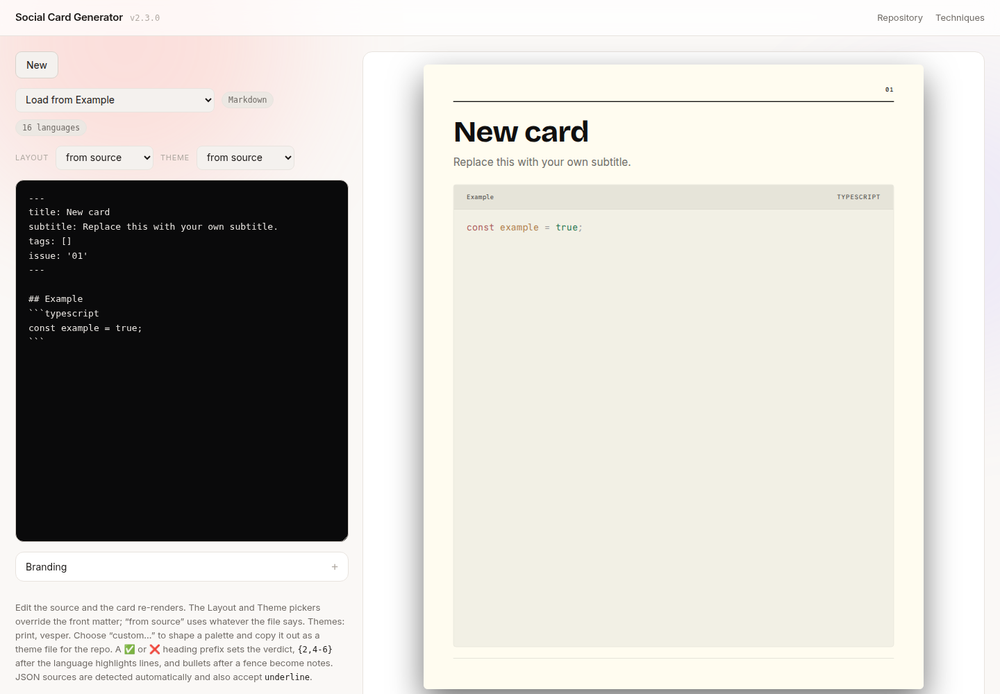
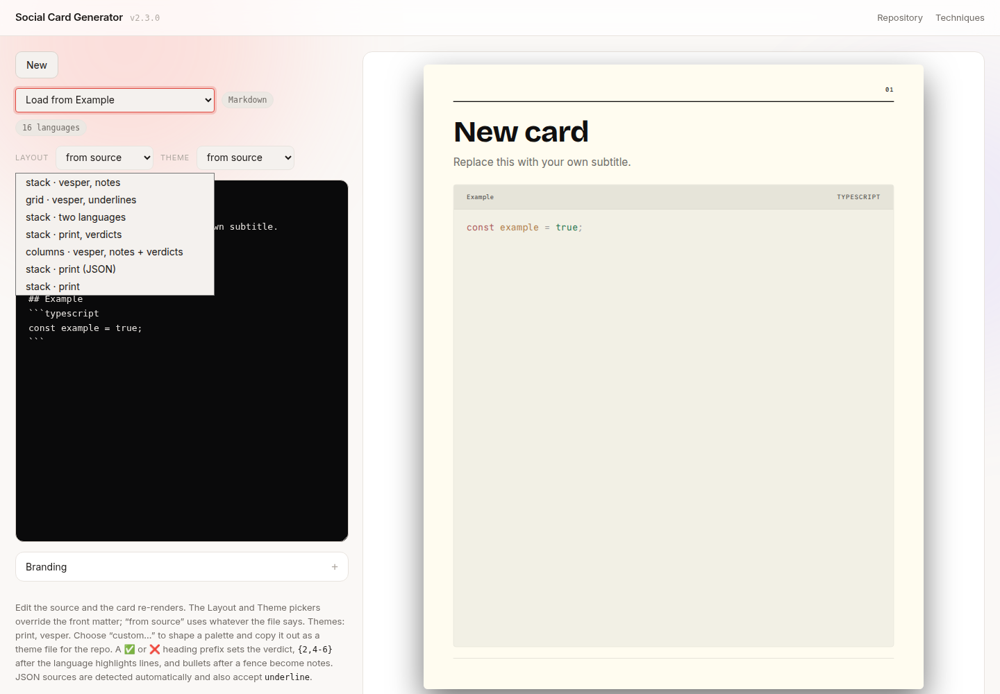
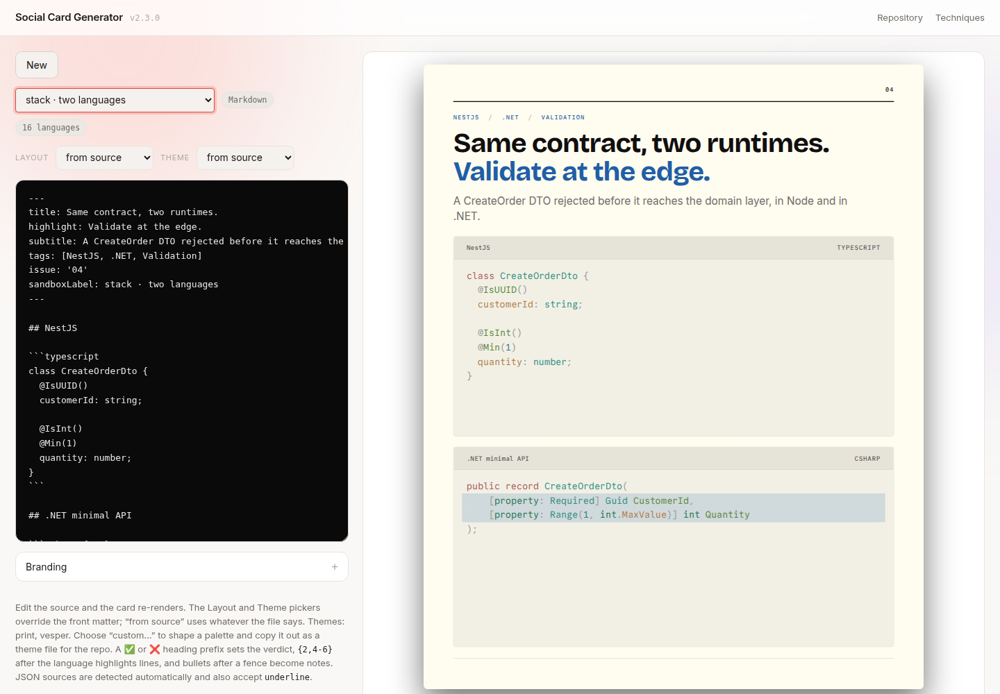
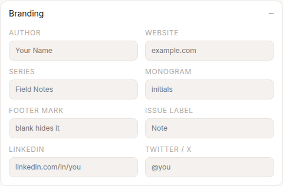
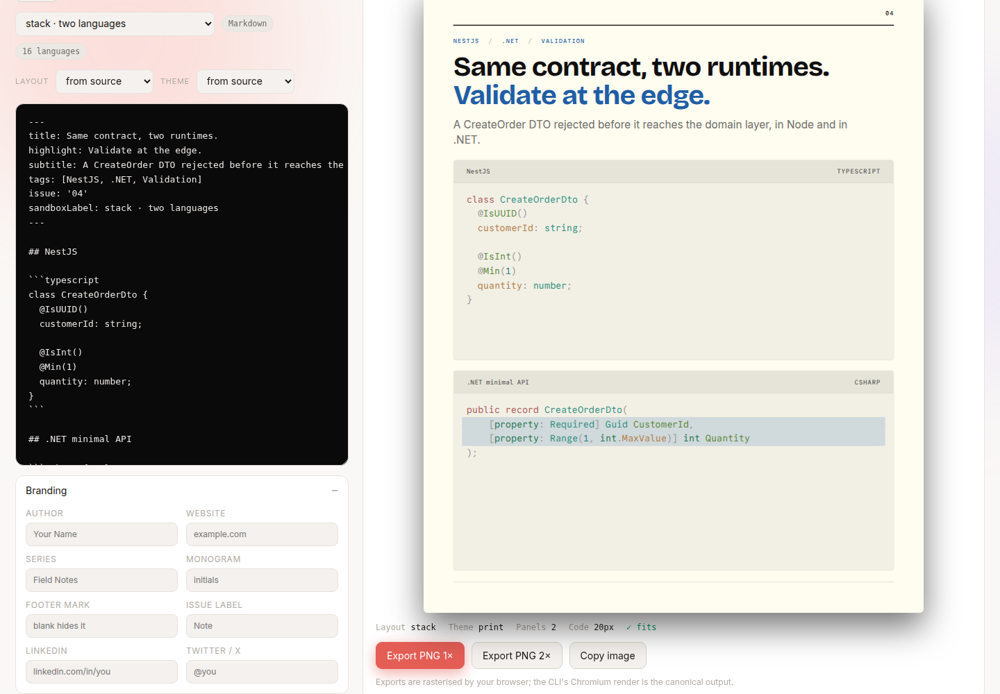
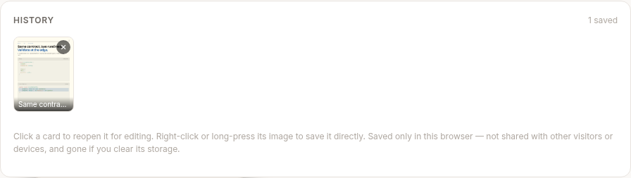
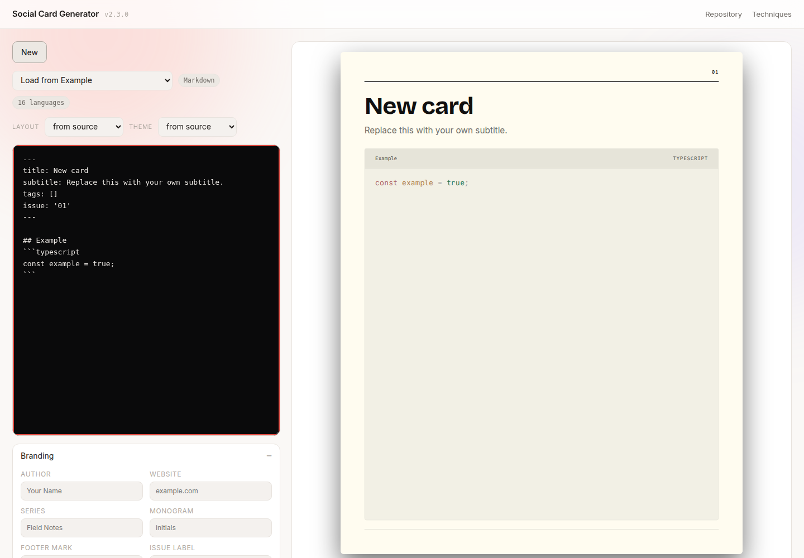

# Social Card Generator — A Quick Tour

This is a short, no-jargon walkthrough of the live demo at **[social-card.manjunathhk.in](https://social-card.manjunathhk.in)**. No account, no install, nothing to configure — just open the link in a browser.

> **What am I looking at?** This tool turns a short piece of text and a code snippet into a polished, shareable image — the kind of graphic you see on LinkedIn or X posts about programming topics. It's one of Manju's personal projects, built and self-hosted end-to-end.

## 1. What you'll see first

When the page loads, you get a blank starting card on the left (the editor) and a live preview on the right. Nothing to sign in to, nothing to download first.

## 2. Load a ready-made example

No need to write anything from scratch. Click the **"Load from Example"** dropdown near the top-left and pick any item from the list.

## 3. Watch the preview update instantly

The moment you pick an example, the panel on the right redraws itself — that's the card as it will actually look when exported. Everything on the left (the text box) is the "recipe"; everything on the right is the finished result.

**Try it:** click inside the text box on the left and change a word in the title. The preview updates as you type — nothing to save, nothing to refresh.

## 4. Personalize it (optional)

Click **"Branding"** to expand a small form — name, website, LinkedIn/X handle, and so on. Fill any of it in and the card's footer picks it up automatically. Every field is optional.

## 5. Export the image

When you're happy with the result, use the **Export PNG** buttons at the bottom of the preview panel. This saves the card as a real image file to your computer, ready to attach to an email or post directly.

## 6. Everything you export is kept in History

Scroll down and you'll find a **History** section — every card you've exported in this browser session, saved as a thumbnail you can click to reopen and keep editing.

> A quick note on privacy: this history lives only in your own browser — nobody else who opens the link sees it, and it isn't stored anywhere on a server.

## 7. Starting over

Click **"New"** at any time to clear the editor and start from a blank card — your exported history is untouched.

---

## That's it

Five things to remember:

1. **Load from Example** → pick something to look at.
2. **Edit the text on the left** → the card on the right updates live.
3. **Branding** → optional personal touches.
4. **Export PNG** → save the image.
5. **History** → everything you've exported, one click away.

No installs, no accounts, no cost. If anything looks broken or confusing, that's useful feedback — feel free to say so.
