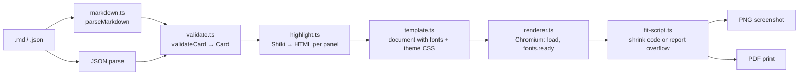

# Techniques

A developer reference for how the generator works and why it is built this way. Read this before changing the renderer, adding a theme or layout, or debugging a card that will not fit.

## Contents

1. [The one idea](#the-one-idea)
2. [Pipeline and module map](#pipeline-and-module-map)
3. [Input: a deliberately small Markdown dialect](#input-a-deliberately-small-markdown-dialect)
4. [Validation that coerces and names the field](#validation-that-coerces-and-names-the-field)
5. [Syntax highlighting with Shiki](#syntax-highlighting-with-shiki)
6. [Self-contained HTML: embedded fonts, blocked network](#self-contained-html-embedded-fonts-blocked-network)
7. [Layout, theme and decoration as separate axes](#layout-theme-and-decoration-as-separate-axes)
8. [The fit loop: measure, don't guess](#the-fit-loop-measure-dont-guess)
9. [PDF carousels from one document](#pdf-carousels-from-one-document)
10. [Playwright details that matter](#playwright-details-that-matter)
11. [Testing strategy](#testing-strategy)
12. [Packaging: tsx in development, compiled JS in the binary](#packaging-tsx-in-development-compiled-js-in-the-binary)
13. [Adding a theme](#adding-a-theme)
14. [Adding a layout](#adding-a-layout)
15. [Gotchas](#gotchas)

## The one idea

The card is an HTML page. Chromium lays it out, and Playwright screenshots it. Everything else exists to produce good HTML or to check the result.

Drawing the card with a canvas or image library would mean re-implementing text wrapping, font fallback, flexbox, shadows and rounded corners. A browser already does all of that, at production quality, from CSS anyone can read. The cost is a Chromium download and about a second of launch time per run, which is acceptable for a publishing tool.

## Pipeline and module map



| Module              | Responsibility                                                                                      | Depends on                              |
| ------------------- | --------------------------------------------------------------------------------------------------- | --------------------------------------- |
| `src/schema.ts`     | The `Card` and `Panel` types, text limits, per-layout rules (panel counts, line limits, font range) | nothing                                 |
| `src/markdown.ts`   | Front matter plus fences, headings, highlight specs and note bullets, into a raw object             | `yaml`                                  |
| `src/validate.ts`   | Raw object into a `Card`; coercion, defaults, limits, language alias resolution                     | `schema`, `themes`, Shiki language list |
| `src/content.ts`    | Picks the parser by file extension and strips a BOM                                                 | `markdown`, `validate`                  |
| `src/highlight.ts`  | One cached Shiki highlighter; line highlights and underline decorations                             | `shiki`                                 |
| `src/fonts.ts`      | `@font-face` rules with WOFF2 files inlined as base64                                               | `@fontsource/*`                         |
| `src/themes/`       | `base.ts` (structure and layout CSS), one file per theme (palette variables), `index.ts` registry   | nothing                                 |
| `src/template.ts`   | Cards into one HTML document                                                                        | all of the above                        |
| `src/fit-script.ts` | The in-browser fit loop as a JavaScript string                                                      | `schema`                                |
| `src/renderer.ts`   | Playwright: launch, route blocking, layout, PNG, PDF                                                | `playwright`, `fit-script`              |
| `src/branding.ts`   | `.env` loading and neutral defaults                                                                 | `node:process`                          |
| `src/cli.ts`        | Argument parsing, input expansion, orchestration, output                                            | everything                              |

Data flows one way. Nothing after `validate.ts` re-checks input, and nothing before `template.ts` knows about HTML.

## Input: a deliberately small Markdown dialect

`parseMarkdown` is a line walker, not a Markdown parser. It accepts exactly this grammar:

```
front matter
( "## " label )? fence ( "- " note )*   repeated
```

Three reasons for not using remark or markdown-it:

- A card source is not a document. Prose between panels has no place on the card, so accepting it would only hide mistakes.
- A line walker gives errors with line numbers ("Line 12: heading is not followed by a code fence"). A generic AST does not know what a "panel" is.
- Zero parsing dependencies beyond `yaml`.

The fence info string carries the language and an optional highlight spec: ` ```csharp {2,4-6} `. Heading prefixes ✅ and ❌ set the verdict and are stripped from the label. Bullets directly after a fence become notes. Token underlines are JSON-only because encoding arbitrary substrings in a fence info string would need an escaping scheme nobody would remember.

## Validation that coerces and names the field

`validateCard` is the only place that inspects raw input. Some choices worth knowing:

- **Scalars are coerced.** YAML turns `issue: 03` into the number 3. Rejecting that with "must be 1–12 characters" is a bad error; the validator accepts numbers and booleans as text and only rejects objects and arrays.
- **Languages are resolved early.** Shiki ships `bundledLanguagesInfo`, a static list of ids, display names and aliases. The validator builds a lookup from it, so `cs` becomes `csharp`, the display name becomes the default label, and an unknown language fails before a browser is launched.
- **Every error names the path.** `panels[1].underline "Lock" does not appear in the code` tells the author exactly where to look.
- **Legacy fields are rejected with a hint.** Version 1 had top-level `code`, `language` and `after`. The validator recognises them and prints the migration message rather than a generic "panels is required".

## Syntax highlighting with Shiki

Shiki runs TextMate grammars, the same ones VS Code uses, in Node. It emits `<span style="color:#…">` per token, so the output needs no stylesheet and no JavaScript in the page. That is exactly what a screenshot pipeline wants.

Three details in `highlight.ts`:

**One highlighter, lazy loading.** `createHighlighter` is expensive because it initialises the regex engine. The module creates it once, with no languages or themes, and calls `loadLanguage` and `loadTheme` on first use. A carousel with six C# cards loads the C# grammar once.

**Line highlights via a transformer.** Shiki calls the `line(node, lineNumber)` hook for every line; the transformer sets `data-highlight="true"` on the lines listed in `highlightLines`, and CSS paints the background. Doing this at the token level rather than post-processing HTML keeps the markup valid.

**Token underlines via decorations.** Shiki's `decorations` option wraps a character range in an element with the given properties. `underlineDecorations` finds every occurrence of each requested substring, converts them to `{ start, end }` character offsets, sorts them, and drops any that overlap an earlier one, because Shiki throws on overlapping decorations. The CSS class `underline` draws a thick coloured `text-decoration`.

## Self-contained HTML: embedded fonts, blocked network

The document must render identically on every machine and never wait on a network. Two mechanisms enforce that:

- `fonts.ts` reads the WOFF2 files from `@fontsource/inter` and `@fontsource/jetbrains-mono` and inlines them as base64 `@font-face` rules. The document is around 100 KB larger and completely portable.
- `renderer.ts` registers `page.route('**/*', route => route.abort())` before loading content. If anyone ever adds an `` to a template, the request fails immediately and visibly rather than sometimes working.

The renderer also awaits `document.fonts.ready` before measuring. Without that, the first measurement can happen with a fallback font and the fit loop makes decisions on the wrong metrics.

## Layout, theme and decoration as separate axes

A card's appearance is the product of three independent choices, and the code keeps them in separate places so a new one of any kind touches one file.

| Axis        | Chosen by        | Lives in                                 | Mechanism                                                         |
| ----------- | ---------------- | ---------------------------------------- | ----------------------------------------------------------------- |
| Layout      | `layout` field   | `schema.ts` rules + `themes/base.ts` CSS | `.layout-<name>` class on the card; flex or grid on `.panels`     |
| Theme       | `theme` field    | `themes/<name>.ts`                       | `.theme-<name>` class sets CSS custom properties                  |
| Decorations | per-panel fields | `template.ts` markup + `base.ts` CSS     | `.verdict-good`, `.panel-notes`, `[data-highlight]`, `.underline` |

The **theme contract** is the set of custom properties `base.ts` reads. A theme must define all of them:

```
--bg --fg --muted --muted-2 --accent --rule --mark-border
--panel --panel-border --panel-shadow --panel-header-bg --panel-header-fg --panel-rule --panel-dot
--line-highlight --underline --notes-fg --good --bad
```

A theme may also add small overrides scoped under its class (the `midnight` theme shows macOS traffic-light dots and tints verdict headers), and it names the Shiki theme used for tokens so code colours match the palette.

Layouts never set colours and themes never move boxes. If you find yourself writing `.theme-x .panels { grid-template-columns … }`, the change belongs in a layout instead.

## The fit loop: measure, don't guess

Character limits cannot guarantee that code fits: a line of `WWWW` is twice as wide as a line of `iiii`. So the renderer measures.

`fit-script.ts` runs inside the page after fonts are ready. For each `.card`:

1. Read the layout's font range from `data-font-max` and `data-font-min` on the card. `stack` runs 20 → 16 px, `columns` 18 → 13 px, `grid` 16 → 12 px.
2. For each `pre.shiki`, start at the maximum and step down by 0.5 px until `scrollWidth` fits the parent's inner width and the rendered height fits the parent's inner height, or the minimum is reached.
3. Apply the smallest size found to every panel on that card. Two panels at different sizes look like a mistake even when both fit.
4. Re-check every panel at that unified size, then check that the card itself does not scroll and the footer's bottom edge sits above the card's bottom margin.
5. Return `{ ok, fontSize, reason }`. The reason names the panel that does not fit, or says the prose is pushing the footer off.

The CLI turns `ok: false` into a non-zero exit and never writes the file. A clipped card that gets posted is worse than no card.

Why a step loop and not a binary search: the range has at most sixteen steps, each is one synchronous layout pass, and monotonicity is not guaranteed once text wrapping interacts with panel heights. Simple and correct beats fast here.

**Why the script is a string.** Playwright serialises a function passed to `page.evaluate` with `Function.prototype.toString`. tsx (and esbuild generally) rewrites functions to preserve their names through a `__name(...)` helper that exists only in the Node bundle, so the serialised source throws `ReferenceError: __name is not defined` inside Chromium. Compiled output from `tsc` does not have this problem, which makes it a bug that appears only in development. Keeping the script as a JavaScript string removes the failure mode in both environments at the cost of type checking on forty lines.

## PDF carousels from one document

LinkedIn carousels are multi-page PDFs. Rather than rendering N single-page PDFs and merging them (which needs a PDF library), the template puts every card into one HTML document and lets Chromium paginate:

- `@page { size: 1080px 1350px; margin: 0 }` makes each PDF page exactly one card.
- `.card { break-after: page }` (with the legacy `page-break-after` alias) forces one card per page. The last card resets it so there is no trailing blank page.
- `page.pdf({ width: '1080px', height: '1350px', printBackground: true, preferCSSPageSize: true })` prints backgrounds, which Chromium omits by default.
- `page.emulateMedia({ media: 'screen' })` first, so the print run uses the same stylesheet the fit loop measured. Without it, `print` media could change metrics after the fit decision.

The fit loop runs once over all cards before printing and reports per card, so the CLI can say which file in a batch overflowed.

## Playwright details that matter

- `deviceScaleFactor` on the page controls PNG resolution without touching CSS. `--scale 2` gives a 2160 × 2700 image with identical layout, which survives platform recompression noticeably better.
- The viewport is fixed at 1080 × 1350 and the screenshot is not full-page. The card is `overflow: hidden` at that exact size, so anything that escapes is a bug the fit check should have caught, not something to capture.
- One browser and one page are reused across a batch. Launch is the expensive part; `setContent` per card is cheap.
- `CARD_BROWSER_PATH` maps to `executablePath`. Playwright pins a specific Chromium revision per version, and containers or CI images often carry a different one. The override lets you use what is installed rather than downloading another 150 MB.

## Testing strategy

Two tiers, split by whether a browser is needed:

| Tier   | Command               | Covers                                                                                                                                                               | Runtime        |
| ------ | --------------------- | -------------------------------------------------------------------------------------------------------------------------------------------------------------------- | -------------- |
| Unit   | `npm test`            | Markdown grammar and error lines, validation and coercion, template markup, decorations, theme inclusion                                                             | under a second |
| Render | `npm run test:render` | Every example layout produces a 1080 × 1350 PNG (2160 × 2700 at 2x); the fit loop shrinks long code and refuses impossible code; three cards become a three-page PDF | a few seconds  |

The render tests check outputs structurally rather than by pixel comparison: the PNG header's IHDR width and height, the `%PDF-` magic bytes, and a count of `/Type /Page` objects. Pixel snapshots would break on every font hinting change across Chromium versions and would not tell you what went wrong. The committed `sample/` images are the visual regression record; a reviewer looks at the diff.

Both tiers use Node's built-in `node:test` runner. No test framework dependency.

## Packaging: tsx in development, compiled JS in the binary

- `npm run card` runs `tsx src/cli.ts` so development needs no build step.
- `npm run build` compiles `src/` to `dist/` with `tsconfig.build.json`, which excludes tests. The `bin` entry points at `dist/cli.js`, and the shebang on the first line of `cli.ts` survives compilation.
- Themes are TypeScript modules exporting CSS strings rather than `.css` files, so the build is a plain `tsc` with no asset copy step, and the compiled package resolves them the same way the source does.
- `files` in `package.json` limits the published tarball to `dist/`, the README, and the licence notices. `prepublishOnly` guarantees a fresh build.
- Card output defaults to `out/` precisely because `dist/` is the compiled CLI.

## Adding a theme

1. Create `src/themes/<name>.ts` exporting a `Theme`: `name`, `description`, `shikiTheme` (any Shiki bundled theme id) and `css` defining every variable in the contract under `.theme-<name>`.
2. Register it in the array in `src/themes/index.ts`. `THEME_NAMES` and validation pick it up automatically.
3. Add an example under `examples/` that sets `theme: <name>`, run `npm run samples`, and add the image to the README gallery.
4. Add the name to the theme table in the README.

If the theme needs a structural tweak (hide the dot, show the traffic lights, change a font weight), scope it under `.theme-<name>` in the same file. If it needs a different arrangement of panels, that is a layout.

## Adding a layout

1. Add the name to `LAYOUTS` in `src/schema.ts` and a `LAYOUT_RULES` entry: panel count range, lines per panel, and the font range the fit loop may use. Lower the font range as panels get narrower.
2. Add `.layout-<name>` rules to `src/themes/base.ts`: how `.panels` arranges its children (flex or grid) and any spacing reductions for the intro, headers and notes. Keep colours out.
3. Add an example, regenerate samples, and extend the layout table in the README.
4. Add the example to the list in `src/render/render.test.ts` so CI proves it renders and fits.

A layout that needs new markup (a caption row, an output pane) also touches `renderCard` in `template.ts`. Keep the markup generic and let the layout class decide visibility.

## Gotchas

- **`__name is not defined` in `page.evaluate`.** See the fit loop section. Do not pass TypeScript functions that contain inner functions to `page.evaluate` under tsx; use a string or hoist to a file that is only ever run compiled.
- **Executable doesn't exist at …/chromium_headless_shell-NNNN.** Playwright and the installed Chromium revision disagree. Either `npm run browser:install` or set `CARD_BROWSER_PATH`.
- **`.env` is read from the current directory**, not the project root. Pass `--env <file>` when running from elsewhere.
- **Two inputs with the same base name** (`caching.md` and `caching.json`) would write the same PNG. The CLI refuses; render them separately or use `--out`.
- **Notes reduce code space.** Three bullets under a panel cost roughly 110 px, which is about four lines of code at 20 px. The fit loop will shrink the code to compensate and fail if it cannot.
- **Highlight lines and underlines are validated against the normalised code** (CRLF converted, trailing whitespace removed). Line numbers count from the first line of the fence, not the file.
